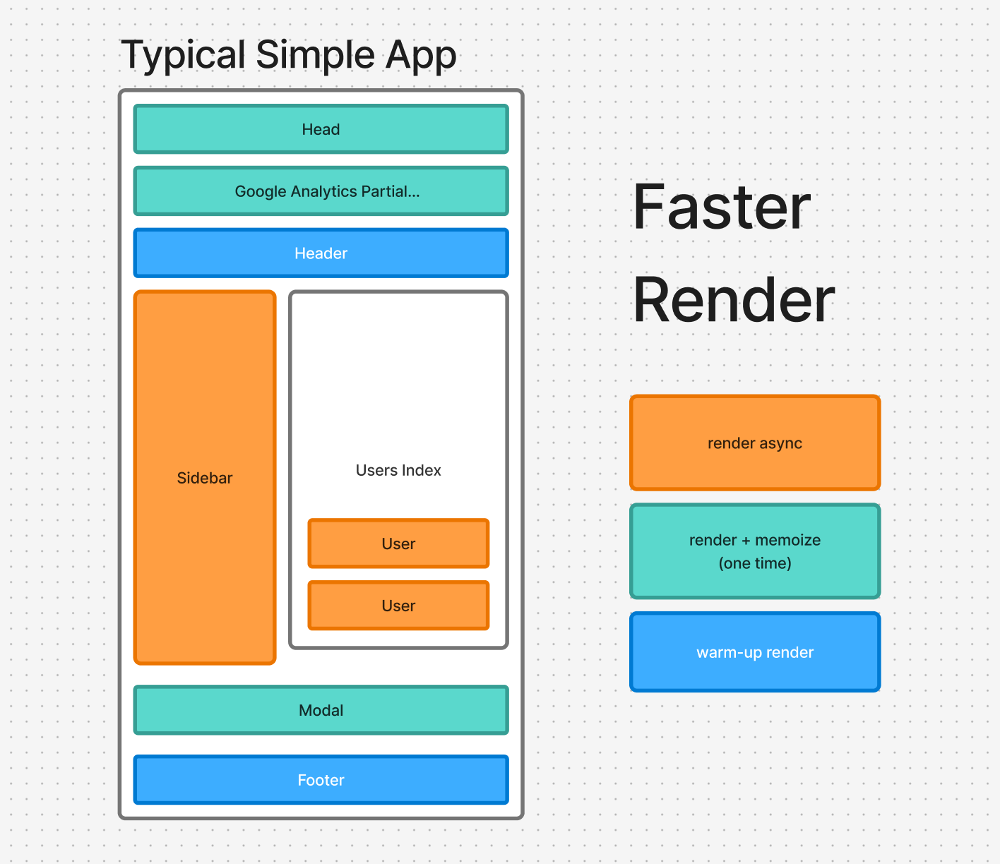

# async_render in Ruby on Rails 🚀

[](https://www.railsjazz.com)


A Rails gem that enables asynchronous view rendering with warmup capabilities and in-memory memoization to significantly improve your application's performance.

On my pet project and my benchmark, I've seen 5-15% improvement in response time. It's really hard to say how much it will improve your application, but it's worth a try.

## ⚡ Ideal use case

- you have heavy partials
- you have partials, with calculations inside, that can be done in background
- your partials has none or a few dependencies on locals
- you have 2+ partials with rendering time more than 100ms
- you have HTML request format (see `Limitations` section)
- you are curious about performance :)

## ✨ Features



### 🔄 Async Rendering

Render multiple view partials asynchronously in background threads, reducing overall page load time by executing independent renders concurrently.

Use cases:
- heavy partials, maybe with calculations inside
- 2+ partials with rendering time more than 100ms

### 🔥 Warmup Rendering

Pre-render partials in your controller actions before the main view is processed. This allows expensive computations to start early and be ready when needed. This must be used in combination with async rendering.

Use cases:
- you are sure that some partials will be rendered

### 💾 Memoized Rendering

Cache rendered partials in memory across requests within the same Ruby process, eliminating redundant rendering of static or rarely-changing content. Warning: do not use it for large amount of content, it will eat up your memory.

Use cases:
- you have static or rarely-changing content (like google analytics, modal, etc)
- it's okay to cache it in memory, and it will be reset after next deployment

## 📦 Installation

Add this line to your application's Gemfile:

```ruby
gem 'async_render'
```

And then execute:

```bash
bundle install
```

### Generator

After installation, run the generator to create an initializer:

```bash
rails generate async_render:install
```

This will create `config/initializers/async_render.rb` with all available configuration options.

## Configuration

The initializer file allows you to configure AsyncRender:

```ruby
AsyncRender.configure do |config|
  # Enable/disable async rendering (default: true)
  config.enabled = Rails.env.production?

  # Timeout for async operations in seconds (default: 10)
  config.timeout = 10

  # Custom thread pool executor (optional)
  # config.executor = Concurrent::FixedThreadPool.new(10)

  # Custom state serialization for thread-local data (optional)
  # config.dump_state_proc = -> { { current_user: Current.user&.id } }
  # config.restore_state_proc = ->(state) { Current.user = User.find_by(id: state[:current_user]) }
end
```

## Usage

### Async Rendering

Use `async_render` in your views to render partials asynchronously:

```erb
<!-- app/views/products/show.html.erb -->
<div class="container">
  <%= async_render 'shared/expensive_sidebar', { user: current_user } %>

  <div class="main-content">
    <%= @product.name %>
  </div>

  <%= async_render 'products/recommendations', { product: @product } %>
</div>
```

### Warmup Rendering

Pre-render partials in your controller to start expensive operations early:

```ruby
class ProductsController < ApplicationController
  # Define warmups for specific actions
  before_action :find_product

  warmups only: [:show] do
    warmup_render 'shared/expensive_sidebar', { user: current_user }
    warmup_render 'products/recommendations', { product: @product }
  end

  def show
  end

  private

  def find_product
    @product = Product.find(params[:id])
  end
end
```

Then use the warmed-up partials in your views:

```erb
<!-- The warmup_render in the controller pre-calculates these -->
<%= async_render 'shared/expensive_sidebar', user: current_user %>
<%= async_render 'products/recommendations', product: @product %>
```

### Memoized Rendering

For content that rarely changes, use memoized rendering to cache results in memory:

```erb
<!-- This will be rendered once and cached in memory -->
<%= memoized_render 'shared/footer' %>

<!-- With locals - cached based on the locals hash -->
<%= memoized_render 'users/avatar', { user: current_user } %>

<!-- With custom formats -->
<%= memoized_render 'api/response', { user: @user } %>
```

## How It Works


1. **Async Rendering**: When you use `async_render`, the gem returns a placeholder immediately and schedules the actual rendering in a background thread
2. **Middleware Processing**: A Rack middleware intercepts the response and replaces placeholders with the actual rendered content.
3. **Thread Safety**: The gem handles thread-local state properly, ensuring CurrentAttributes and other thread-local data work correctly
4. **Automatic Pool Sizing**: Thread pool size is automatically determined based on your database pool size and Rails configuration

## Best Practices

### ⚠️ Limitations

- doesn't work with view_components yet, just didn't try yet
- partials you render in background doesn't have access to the request, so you need to pass "current_user" as locals
- if you use "Current" attributes, you need to pass them as locals, or pass as state to render (see `dump_state_proc` and `restore_state_proc` in the initializer)
- warmup rendering under the hood uses simply before_action, so you need to prepare data in the controller action, not in the view.
- for now only HTML request format is supported, but I'm working on it.
- it will mess up your logs, because some rendering may happen after logs like "Completed 200 OK in 1761ms".

### ✅ Do

- Use async rendering for expensive, independent view components
- Warmup partials that you know will be needed
- Memoize static or rarely-changing content
- Monitor your database connection pool usage

### ❌ Don't

- Use async rendering for trivial partials (overhead may exceed benefits)
- Share mutable state between parallel renders
- Rely on request-specific data without proper state management
- Use excessive async rendering that could exhaust database connections

## Testing in Production

For example you can disable async rendering:

```ruby
class ApplicationController < ActionController::Base
  before_action do
    AsyncRender.enabled = params[:skip_async].blank?
  end
end
```

## Performance Considerations

- The gem automatically limits parallelism based on available database connections
- Default timeout is 10 seconds for async operations
- Memoized content persists for the lifetime of the Ruby process
- Consider memory usage when memoizing large amounts of content

## TODO

- [ ] add support for view_components
- [ ] add support for turbo_stream
- [ ] improve performance? what we can do to make it faster?
- [ ] support for different cache stores for memoized rendering
- [ ] support for nested async rendering
- [ ] added instrumentation for async rendering
- [ ] better error handling
- [ ] better documentation
- [ ] better state management for thread variables
- [ ] better compatibility with "render" method, if AsyncRender is disabled, 100% fallback to the original render method. This kind of fallback is already implemented, but I think it can be improved.

## Benchmarks

I used local and pet project to benchmark the gem.

I also used `oha` to benchmark the gem.

I do not specify the exact numbers, but I can say that the gem is working as expected. Once gem will be more mature, I will add more benchmarks.

## Contributing

Bug reports and pull requests are welcome on GitHub at https://github.com/igorkasyanchuk/async_render.

## License

The gem is available as open source under the terms of the [MIT License](https://opensource.org/licenses/MIT).
